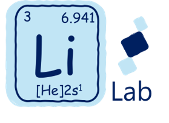

---
---

# Welcome!

  

Our Lab performs interdisciplinary research to synthesize and understand the  structural dynamics of novel solid-state materials. Currently we are interested in energy storage materials, quantum materials, and heterogeneous catalysts. We welcome students with backgrounds in chemistry, physics, and (chemical, materials, and mechanical) engineering to join us :)



## Highlights



Our research involves developing new approaches to synthesize functional solid-state materials, characterization of their atomic structural behaviors, and understanding the correlation between structure and properties of the solid-state materials. We focus on solid-state NMR and X-ray/Neutron scattering characterization techniques.  Our current interests lie in energy storage materials, quantum materials, and heterogeneous catalysts. 









Join us : )









Layered structures (LuFeO3)nLuFe2O4 exhibit a common structural transformation upon oxygen uptake. Although the LuFeO3 units do not directly participate in oxygen insertion, these inactive layers nevertheless influence the temperature at which oxygen absorption occurs.









Tianyu finished his postdoc fellowship at UCSB. I will miss the life in Santa Barbara and mentorship from both Raphaele and Ram.







